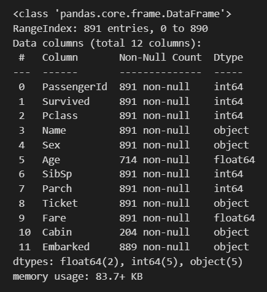

# EXNO2DS
# AIM:
To perform Exploratory Data Analysis on the given data set.
      
# EXPLANATION:
  The primary aim with exploratory analysis is to examine the data for distribution, outliers and anomalies to direct specific testing of your hypothesis.
  
# ALGORITHM:
STEP 1: Import the required packages to perform Data Cleansing,Removing Outliers and Exploratory Data Analysis.

STEP 2: Replace the null value using any one of the method from mode,median and mean based on the dataset available.

STEP 3: Use boxplot method to analyze the outliers of the given dataset.

STEP 4: Remove the outliers using Inter Quantile Range method.

STEP 5: Use Countplot method to analyze in a graphical method for categorical data.

STEP 6: Use displot method to represent the univariate distribution of data.

STEP 7: Use cross tabulation method to quantitatively analyze the relationship between multiple variables.

STEP 8: Use heatmap method of representation to show relationships between two variables, one plotted on each axis.

## CODING AND OUTPUT
### NAME : YUVARAJ S
### Register Number : 212222240119
```py
import pandas as pd
d=pd.read_csv("titanic_dataset.csv")
d.head()
```


```
d.info()
```


```
d.set_index('PassengerId',inplace=True)
d.describe()
```


```
d.shape
```


```
d.nunique()
```


```
d["Survived"].value_counts()
```


```
per=(dt["Survived"].value_counts()/d.shape[0]*100).round(2)
per
```


```
sns.countplot(data=d,x="Survived")
```


```
d.Pclass.unique()
```


```
d.rename(columns={'Sex':'Gender'},inplace=True)
dt
```


```
sns.catplot(x="Gender",col="Survived",kind="count",data=d,height=5,aspect=.7)
```


```
d.boxplot(column="Age",by="Survived")
```


```
sns.scatterplot(x=d["Age"],y=d["Fare"])
```


```
sns.jointplot(x=d["Age"],y=dt["Fare"],data=d)
```


```
fig,ax1=plt.subplots(figsize=(8,5))
pt=sns.boxplot(ax=ax1,x='Pclass',y='Age',hue='Gender',data=d)
```


```
sns.catplot(data=d,col="Survived",x="Gender",hue="Pclass",kind="count")
```


```
corr=d.corr()
sns.heatmap(corr,annot=True)
```


```
sns.pairplot(d)
```


# RESULT
Thus,Data Analyzing of the given dataset was successful.
